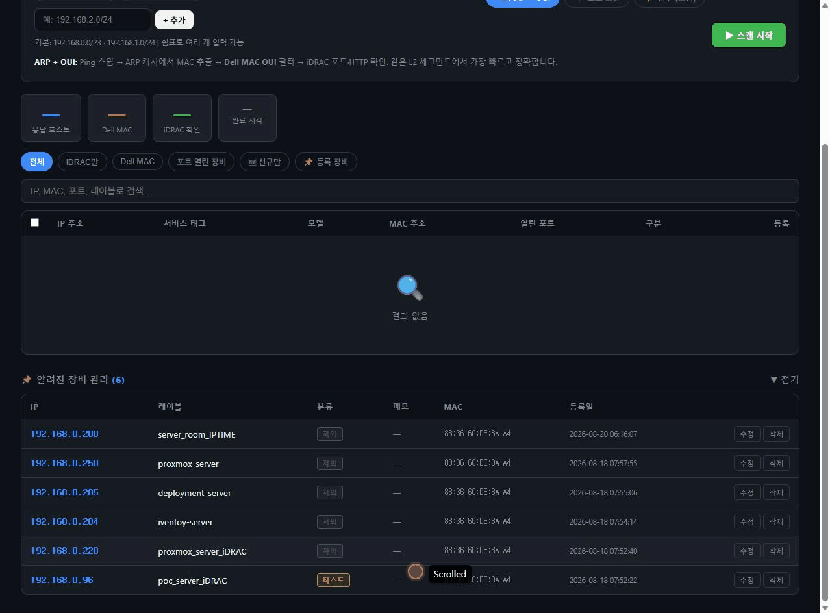

<div align="center">

# 🖥️ iDRAC Manager

**Dell iDRAC 장비를 네트워크에서 자동 탐지하고 일괄 설정을 적용하는 웹 관리 도구**

[](https://github.com/jaeil-park/idrac-scanner/actions/workflows/docker.yml)
[](https://ghcr.io/jaeil-park/idrac-scanner)
[](https://www.python.org/)
[](LICENSE)

</div>

---

## 📺 데모

> 스캔 범위 설정 → 자동 스캔 → 장비 발견 → 서브넷 계산기 → 일괄 설정 프리셋 적용



---

## ✨ 주요 기능

| 기능 | 설명 |
|------|------|
| 🔍 **자동 스캔** | Ping 스윕 → ARP/OUI 필터 → 포트 확인 → Redfish 핑거프린팅 |
| 🏷️ **서비스 태그 수집** | Dell iDRAC Redfish API로 시리얼 번호·모델명 자동 조회 |
| ⚙️ **일괄 설정** | NTP·DNS·SNMP·BIOS 등 프리셋을 여러 장비에 동시 적용 |
| 🔧 **하드웨어 정보 팝업** | 스캐너에서 서비스 태그 클릭 → CPU·메모리·디스크·NIC·PSU·펌웨어 상세 (Redfish, DB 캐시) |
| 🔄 **펌웨어 업데이트** | 일괄 설정 페이지에서 Dell DUP 파일 업로드 또는 공유 URI로 여러 iDRAC에 순차 설치 (Redfish) |
| 🖥️ **웹 SSH 콘솔** | 브라우저에서 iDRAC/서버로 직접 SSH — `/console` (flask-sock + paramiko) |
| 📋 **장비 관리** | 등록·미등록 구분, 카테고리 태그, 메모, 자격증명 저장 |
| 🌐 **스캔 범위 설정** | CIDR 단위 범위 추가·삭제, 기본값 192.168.0.0/23 |
| 🔢 **서브넷 계산기** | CIDR 입력 시 네트워크/브로드캐스트/호스트 수 즉시 계산 |
| 🛡️ **게이트웨이 MAC 감지** | 동일 MAC이 3개 이상 IP에 출현 시 라우터로 자동 판별 |
| 📡 **크로스 서브넷 탐지** | ARP 불가 구간은 포트 스캔 + Redfish 핑거프린팅으로 탐지 |

---

## 🚀 빠른 시작

### 1단계 — `.env` 파일 생성

```bash
cat > .env << 'EOF'
# iDRAC 폴백 자격증명 (실제 비밀번호로 수정)
IDRAC_FALLBACK_CREDS=[["root","calvin"]]
PORT=5010
DB_PATH=/data/known_devices.db
EOF
```

### 2단계 — Docker Compose 실행

```bash
# docker-compose.yml 다운로드
curl -O https://raw.githubusercontent.com/jaeil-park/idrac-scanner/main/docker-compose.yml

# 실행
docker compose up -d
```

### 3단계 — 접속

```
http://<서버IP>:5010
```

> **Linux 전용**: `network_mode: host`가 필요한 ARP 스캔은 Linux 호스트에서만 동작합니다.

---

## 🔧 환경 변수

| 변수 | 기본값 | 설명 |
|------|--------|------|
| `PORT` | `5010` | 웹 서버 포트 |
| `DB_PATH` | `/data/known_devices.db` | 장비 DB 저장 경로 |
| `IDRAC_FALLBACK_CREDS` | `[["root","calvin"]]` | iDRAC 폴백 자격증명 JSON 배열 |
| `FW_LIB_DIR` | (없음) | 컨테이너 내 펌웨어 라이브러리 경로. 지정 시 일괄 설정 → 펌웨어 → **NAS 라이브러리** 탭에서 해당 디렉토리를 재귀 탐색해 파일 선택 |
| `FW_LIB_HOST` | `/mnt/nas-firmware` | 호스트에 마운트된 NAS 펌웨어 디렉토리 (compose bind mount 원본) |

```env
# 예시: 여러 자격증명 등록
IDRAC_FALLBACK_CREDS=[["root","calvin"],["root","YourPass1"],["admin","AdminPass"]]
```

---

## 🏗️ 기술 스택

| 영역 | 기술 |
|------|------|
| Backend | Python 3.11 · Flask · SSE(Server-Sent Events) |
| 스캔 | ARP · ICMP · Socket · Dell Redfish API |
| 설정 엔진 | Redfish PATCH · racadm CLI (선택) |
| 저장소 | SQLite (장비 정보 · 자격증명 · 프리셋) |
| 컨테이너 | Docker · GitHub Actions → ghcr.io |

---

## 📁 스캔 방식

```
Ping Sweep (ICMP)
    │
    ▼
ARP 캐시 조회 → MAC 추출
    │
    ├─ Dell OUI 일치 ──────────────→ 포트 확인 (443, 80, 623)
    │                                      │
    └─ 동일 MAC 3개+ (게이트웨이) → 포트 스캔 + Redfish 핑거프린팅
                                           │
                                           ▼
                                   서비스 태그 · 모델명 수집
                                   (iDRAC 세션 제한 고려, 최대 8 동시)
```

---

## 📦 Docker 이미지

GitHub Actions가 `main` 브랜치 push 시 자동 빌드합니다.

```bash
# 최신 이미지 pull
docker pull ghcr.io/jaeil-park/idrac-scanner:latest
```

### racadm 설치 (선택)

Dell iDRAC Tools tarball을 프로젝트 루트에 추가 후 로컬 빌드:

```bash
cp /path/to/Dell-iDRACTools-Web-LX-*.tar.gz .
docker compose build
```

tarball 없이 빌드하면 **Redfish API 전용 모드**로 동작합니다.

---

## 📖 배포 가이드

전체 배포 방법 (Docker Compose / Portainer / 로컬 실행 / 업데이트) →

**[📄 docs/DEPLOY.md](docs/DEPLOY.md)**

---

## 🔒 보안

- iDRAC 자격증명은 `IDRAC_FALLBACK_CREDS` **환경 변수**로만 관리됩니다
- `.env` 파일은 `.gitignore`에 등록되어 저장소에 포함되지 않습니다
- Dell iDRAC Tools tarball 역시 `.gitignore`에 등록되어 커밋되지 않습니다

---

## 📄 라이선스

MIT License — 자세한 내용은 [LICENSE](LICENSE) 파일을 참조하세요.
